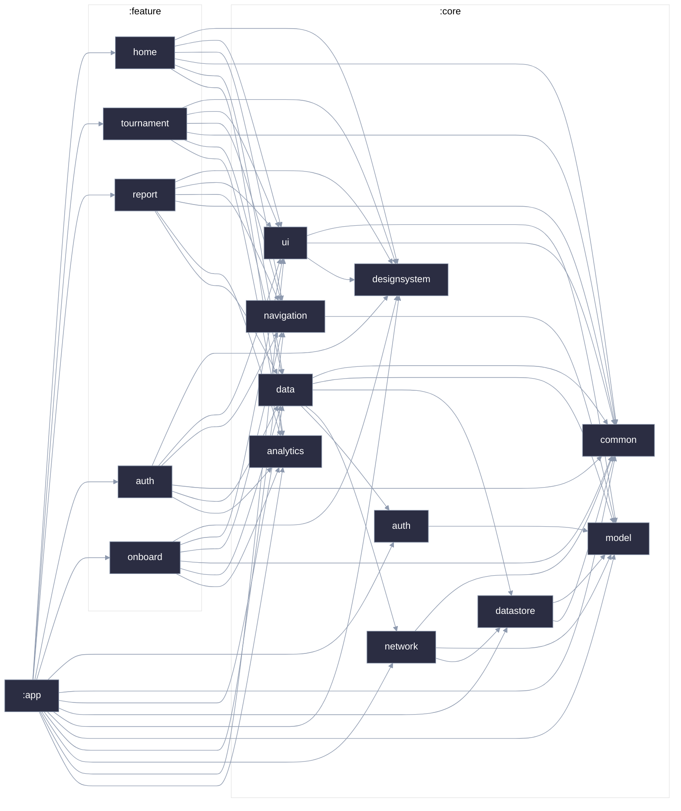

무딧 : 나만의 패션 취향 정립 서비스
=====


<a href="https://play.google.com/store/apps/details?id=com.swyp.moodit">
  
</a>

### 📌 프로젝트 개요

#### 무딧은 사진을 비교하며 선택 기준을 발견하고, 경험의 만족도까지 쌓아 수집을 넘어
`취향을 정립할 수 있도록 도와주는` 서비스입니다.

### 📒 주요 기능
- #### ⚔️ 무드매치 (토너먼트 기반 취향 탐색)
  - `Photopicker`로부터 8~32장 사이의 이미지를 업로드하여 무드매치 생성
  - 1:1 비교 및 선택 이유(가치관) 태깅
    - 두 개 사진 중 더 마음에 드는 사진을 선택하고, 선택 이유(예: 나와의 적합도, 심미성, 트렌드 등)를 선택하여 사용자 스스로 호불호 기준을 의식하도록 유도
  - 맞춤형 경험 미션 생성 및 제안
    - 무드매치 결과에 따라 가장 높게 측정된 우선순위 기준을 분석하고, 실제로 검증해 볼 수 있는 맞춤형 미션을 자동으로 제안

- #### 📚 무드매치 & 미션 관리
  - 진행 상태별 무드매치 / 미션 트래킹
    - 진행 중인 무드매치(이어하기)와 완료된 무드매치 목록을 한눈에 조회하고 괸리
  - 경험 수행 및 만족도 평가
    - 제안받은 미션을 직접 실행한 후, 평점(1.0 ~ 5.0점) 기반의 만족도를 기록
    - 2.5점 이하를 선택한 경우 불만족사유 수집

- #### 📊 취향 리포트
  - 데이터 누적 기반 취향 시각화
    - 무드매치 선택 패턴과 미션 만족도 데이터(무드매치 횟수, 완료 미션 수 등)를 결합하여 분석
  - 가장 중요하게 생각하는 척도 분석
    - 자신이 스타일을 선택할 때 가장 중요하게 생각하는 요소(예: 신체 적합도, 디자인 색감 등)를 비율과 텍스트 형태의 리포트로 제공
  - 시도한 취향의 평균 만족도 분석
    - 실제 시도했던 미션들의 평균 점수 및 세부 분포를 통계 데이터로 시각화하여 명확한 취향 기준을 확인할 수 있도록 제공
   
<br>

##### - 📋 서비스 소개 : [서비스 소개글 바로가기](https://drive.google.com/file/d/1lhMLd-8QqnfsSrbIkX3u8l_Tu_1WIw_8/view?usp=drive_link)

##### - 📺 시연 영상 : [시연 영상 보러가기](https://drive.google.com/file/d/1Dh6iZ6gKaIVskB1KB0A0Mg5RrZBRARrE/view?usp=drive_link)

---

## Tech Stack

| 구분 | 기술 스택 |
| --- | --- |
| `Version` | Kotlin 2.3.21 / JVM 21 / SDK 28~36 / AGP 9.2.1 |
| `Architecture` | Clean Architecture, MVI, Multi-Module |
| `UI` | Jetpack Compose |
| `DI` | Hilt |
| `Network` | Retrofit2, OkHttp |
| `Async` | Coroutine, Flow |
| `Build Tools` | Gradle Version Catalog + Custom Convention Plugins |
| `Analytics` | Firebase Analytics |
| `Third Party` | Kakao Login API |
| `Libraries & Utils` | Timber / Coil / Lottie |
| `Communication` | Figma / Notion / Rildo / Discord / Google Sheets |

## 모듈 & 패키지 구조

### Module Dependency Graph



### Package Structure

```
🗃️app

🗃️build-logic

🗃️core
 ┣ 🗃️analytics
 ┣ 🗃️auth
 ┣ 🗃️common
 ┣ 🗃️data
 ┣ 🗃️datastore
 ┣ 🗃️designsystem
 ┣ 🗃️model
 ┣ 🗃️navigation
 ┣ 🗃️network
 ┗ 🗃️ui

🗃️feature
 ┣ 🗃️auth
 ┣ 🗃️home
 ┣ 🗃️onboarding
 ┣ 🗃️report
 ┗ 🗃️tournament
 ```
